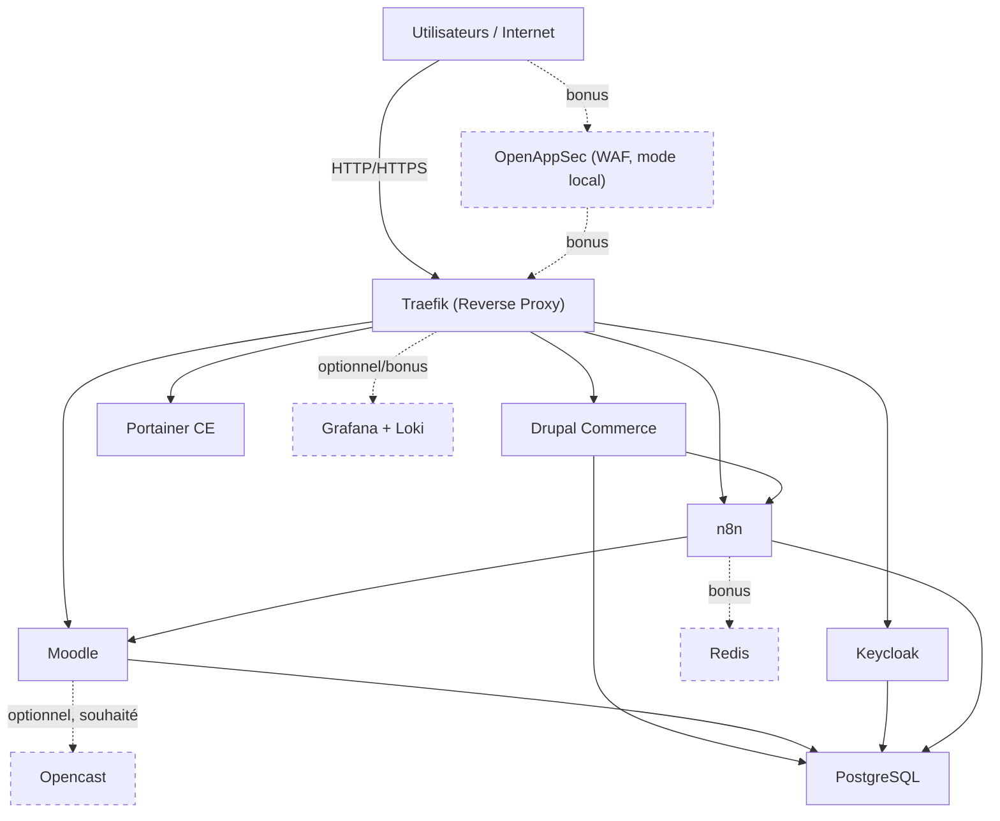

# 4. Architecture cible

Votre architecture devra suivre un modèle semblable au suivant :

Parcours métier : vente sur Drupal Commerce → workflow n8n → accès Moodle. Les nœuds en pointillé (WAF, Opencast, Redis, Grafana/Loki) sont optionnels ou bonus.

> Le WAF (OpenAppSec) apparaît en pointillé : il s'agit d'un composant **bonus**, non requis pour exposer Traefik. Voir [6. Bonus — WAF](06-bonus-waf-openappsec.md) pour les règles complètes.

Ce schéma n'est pas figé. Vous pouvez l'ajuster si vous justifiez clairement vos choix. Toutefois, les principes suivants doivent être respectés :

- les services de données ne doivent pas être exposés directement à Internet;
- les points d'entrée doivent être limités et centralisés;
- les réseaux internes doivent être segmentés;
- les flux d'authentification doivent être documentés;
- le flux d'attribution d'accès après commande doit être documenté;
- l'architecture doit illustrer une logique de défense en profondeur.
