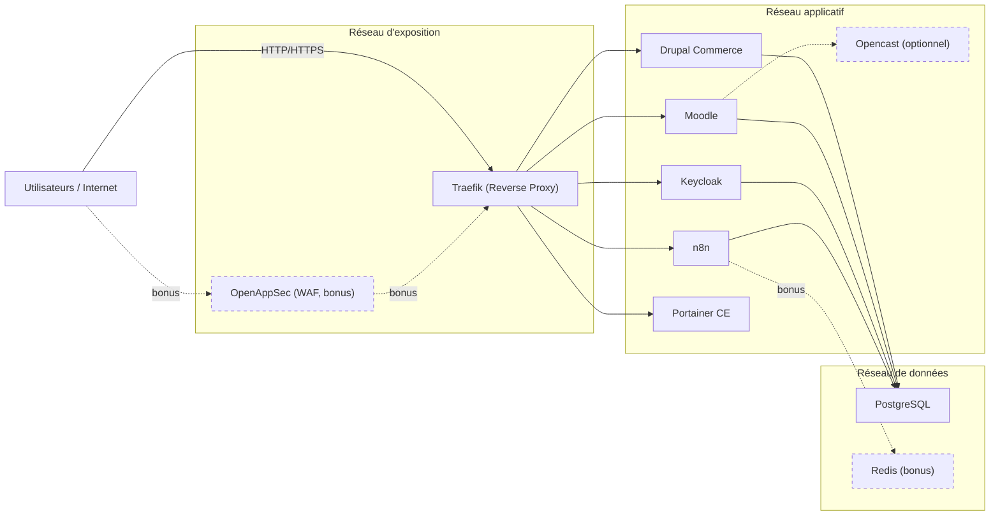
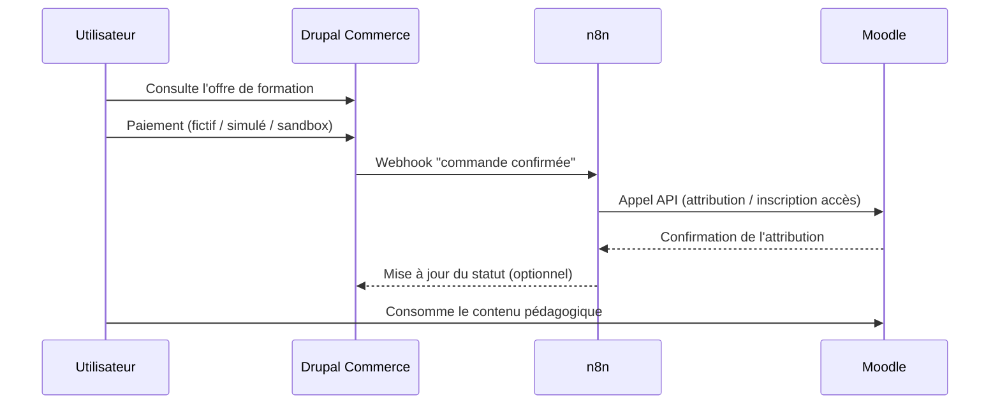
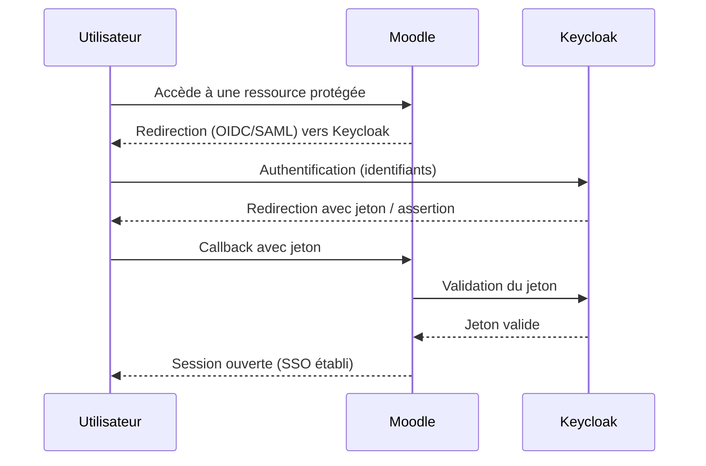

# 5. Exigences techniques

Votre solution devra démontrer les éléments suivants.

## 1. Couche VM as Code

Le fichier cloud-init doit permettre, au minimum :

- la création d'un utilisateur d'administration;
- la configuration de l'accès SSH;
- l'application des mises à jour initiales du système;
- l'installation de Docker Engine et de Docker Compose;
- la préparation des répertoires de travail;
- l'activation ou la configuration minimale d'un pare-feu hôte;
- la préparation de l'environnement de journalisation de base si applicable.

Vous devez expliquer ce que cloud-init configure automatiquement, ainsi que les limites de votre automatisation.

## 2. Couche conteneurisée

Votre déploiement Docker Compose doit inclure :

- les services applicatifs imposés;
- la présence d'une logique d'intégration claire entre Drupal Commerce, n8n et Moodle;
- les réseaux Docker nécessaires;
- les volumes persistants pertinents;
- la configuration minimale des variables d'environnement;
- des ports exposés limités au strict nécessaire;
- une logique claire de dépendances entre services.

## 3. Sécurité des images

Vous devez démontrer :

- l'utilisation d'images maintenues et identifiées par une version explicite;
- l'absence de dépendance inutile lorsque possible;
- au moins un mécanisme de validation ou de scan de sécurité d'image, réalisé avec un outil local ou hors-ligne (ex. Trivy, Grype) plutôt qu'un service cloud;
- une réflexion sur la provenance, la taille ou le niveau de confiance des images retenues.

## 4. Sécurité à l'exécution

Vous devez démontrer, lorsque possible :

- l'exécution de services avec un utilisateur non-root;
- l'absence de mode privilégié non justifié;
- la réduction des privilèges;
- l'usage de `security_opt` appropriés, par exemple `no-new-privileges:true` lorsque compatible;
- des limites de ressources;
- des volumes et systèmes de fichiers montés de manière prudente;
- des vérifications de santé pour les services critiques.

## 5. Segmentation réseau

Votre architecture devra montrer une séparation logique entre :

- le réseau d'exposition;
- le réseau applicatif;
- le réseau de données.

Vous devrez être capables d'expliquer quels services communiquent entre eux, pourquoi ils en ont besoin, et quels accès sont volontairement interdits.

Aucun service du réseau de données (PostgreSQL, Redis) n'est directement joignable depuis Internet ou exposé par Traefik : seuls les services applicatifs y accèdent, en interne.

## 6. Intégration fonctionnelle sans codage avancé

Votre solution doit démontrer un flux métier minimal cohérent :

- un catalogue ou produit de formation dans Drupal Commerce;
- un paiement fictif, simulé ou sandbox;
- un déclenchement de workflow dans n8n;
- une attribution, inscription ou activation d'accès côté Moodle;
- une consommation du contenu d'apprentissage dans Moodle.

Aucune intégration comptable complète n'est requise. Aucune preuve de paiement réelle n'est exigée. L'évaluation portera sur la cohérence fonctionnelle, l'intégration visuelle et la sécurité de l'architecture, et non sur le développement applicatif.

## 7. Défense en profondeur

Votre plateforme doit montrer plusieurs couches de protection complémentaires, par exemple :

- WAF en frontal *(bonus, optionnel — voir [6. Bonus — WAF](06-bonus-waf-openappsec.md))*;
- reverse proxy centralisé;
- segmentation réseau;
- IAM et SSO;
- réduction des privilèges;
- logs et traçabilité;
- limitation de l'exposition externe.

## 8. Identité et SSO

Vous devez configurer **Keycloak** comme fournisseur d'identité. Le minimum attendu est un SSO fonctionnel entre Keycloak et Moodle. L'intégration SSO avec Drupal Commerce est souhaitable, mais elle peut être traitée comme une bonification ou comme une amélioration future si votre équipe préfère stabiliser d'abord le noyau de la plateforme.

## 9. Observabilité et exploitation

**Portainer CE est obligatoire** afin d'offrir une vue graphique pédagogique de l'environnement conteneurisé. Vous devrez l'utiliser pour illustrer les conteneurs, les réseaux, les volumes, les états et certains journaux d'exécution.

Un mécanisme additionnel de journalisation centralisée est fortement recommandé. **Grafana Loki** constitue une option légère et pédagogique pour agréger, consulter et rechercher des journaux issus de plusieurs services.
