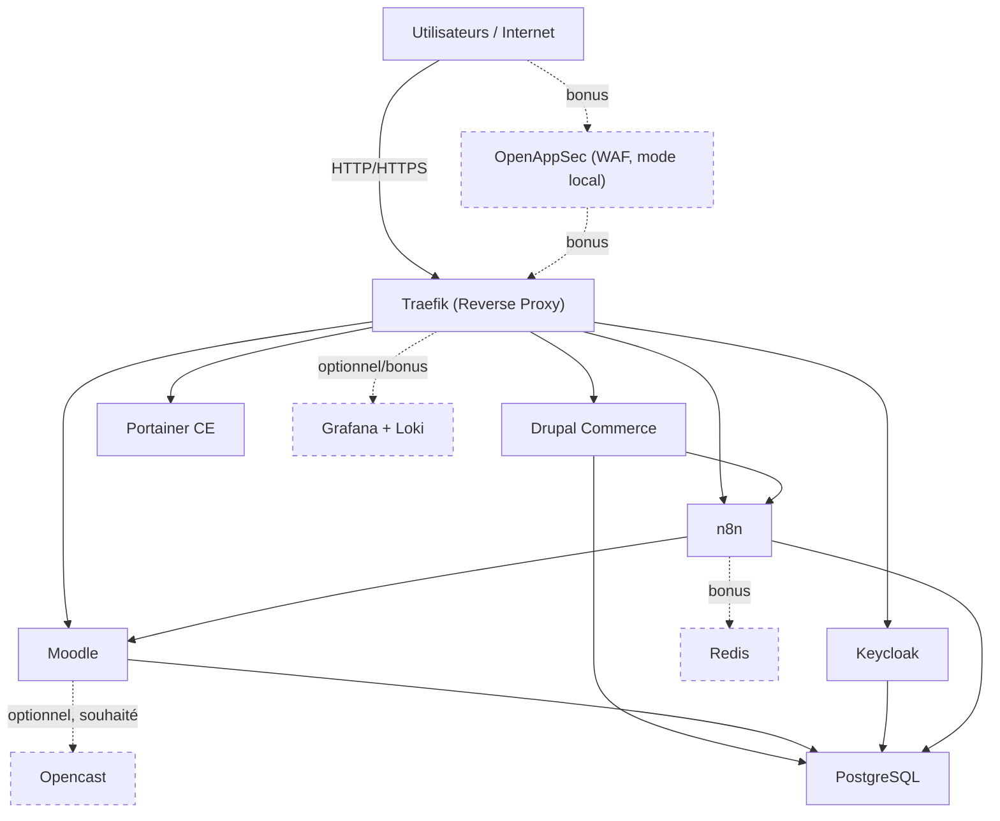
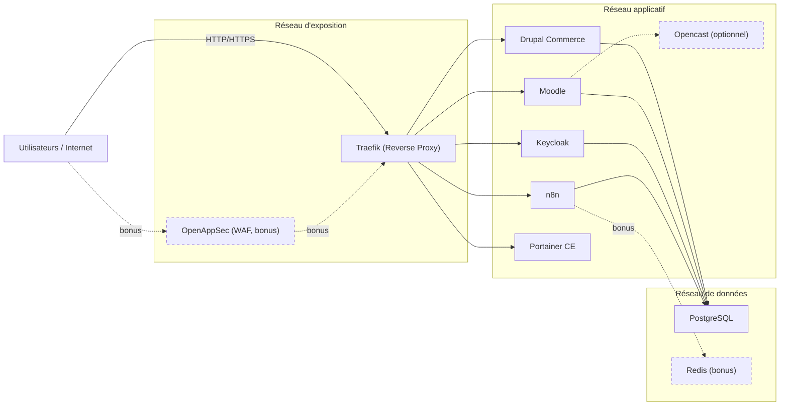
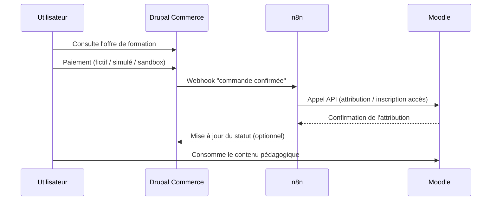
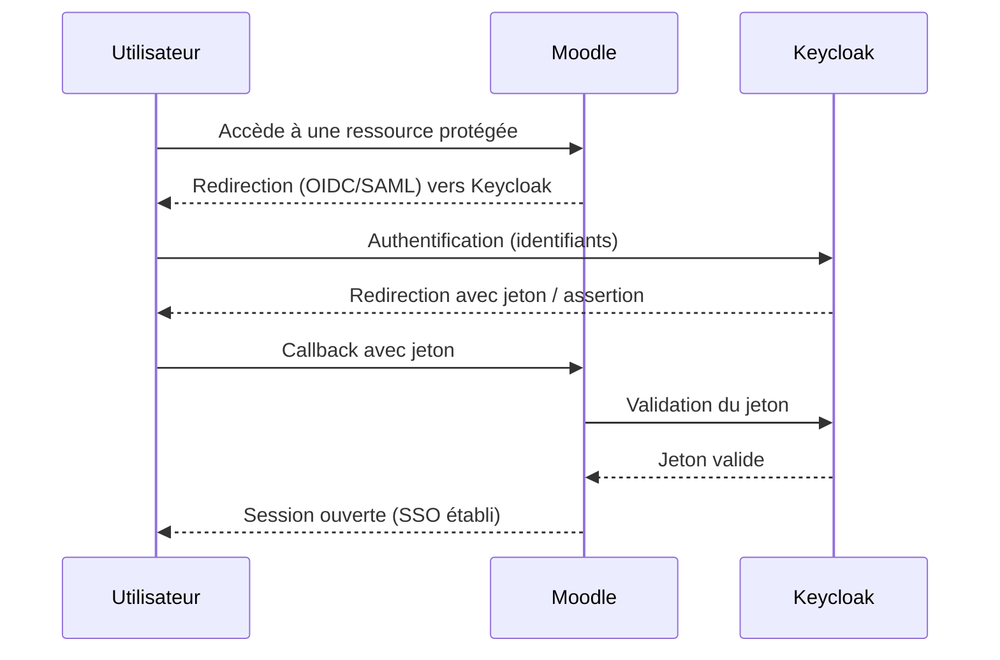

# Travail de session — Architecture sécurisée d'une plateforme pédagogique conteneurisée sur VM as Code (document consolidé)

> Ce fichier fusionne en un seul document l'énoncé complet du travail de session, la grille de correction détaillée et la grille de correction en format tableau. Il est généré à partir de `md/official_enonce_travail_session_containers.md`, `md/grille_correction_travail_session_containers.md` et `md/grille_correction_tableau.md`, qui demeurent les fichiers sources faisant foi individuellement en cas de divergence.

## Table des matières

- [Partie 1 — Énoncé du travail de session](#partie-1)
- [Partie 2 — Grille de correction détaillée](#partie-2)
- [Partie 3 — Grille de correction — format tableau](#partie-3)

<a id="partie-1"></a>

## Partie 1 — Énoncé du travail de session

### Travail de session — Architecture sécurisée d'une plateforme pédagogique conteneurisée sur VM as Code

#### Informations générales

**Pondération :** 40 points, soit 40 % de la note finale.  
**Taille des équipes :** 3 à 5 étudiants.  
**Format de réalisation :** travail d'équipe.  
**Environnement cible :** une machine virtuelle Linux initialisée par cloud-init et hébergeant une plateforme conteneurisée déployée avec Docker Compose.  
**Objectif pédagogique :** démontrer des compétences de base en architecture de solutions conteneurisées, en sécurité des conteneurs, en défense en profondeur, en gestion des identités, en segmentation réseau, en observabilité et en automatisation de l'infrastructure.

Ce travail de session vise à vous placer dans une situation réaliste de conception et de déploiement d'une plateforme numérique auto-hébergée, tout en vous imposant une complexité raisonnable pour un premier projet de sécurité des conteneurs. Vous devrez livrer une architecture fonctionnelle, explicable, reproductible et suffisamment sécurisée pour illustrer les bonnes pratiques vues au cours, notamment le durcissement des images, le durcissement à l'exécution, la réduction des privilèges, la segmentation des réseaux, le durcissement de l'hôte, l'observabilité et l'intégration de contrôles de sécurité en amont du déploiement (shift left).

#### Mandat

Votre équipe doit concevoir, automatiser, déployer et documenter une plateforme pédagogique conteneurisée composée de plusieurs services open source intégrés entre eux. La plateforme doit être déployée sur **une VM unique provisionnée en mode VM as Code à l'aide de cloud-init**, puis exploitée au moyen de conteneurs orchestrés avec Docker Compose.

L'architecture devra intégrer les composants suivants :

- **Traefik** comme reverse proxy d'entrée et contrôleur d'exposition web.
- **OpenAppSec** (bonus) de Check Point comme couche WAF ou protection applicative en frontal, configurée en mode local sans dépendance à un compte cloud tiers. Ce composant est optionnel et n'est pas requis pour la réussite du livrable.
- **Drupal Commerce** comme portail transactionnel de vente des formations et contenus pédagogiques.
- **Moodle** comme LMS principal et plateforme de consommation des contenus après attribution des droits d'accès.
- **Keycloak** comme fournisseur d'identité et de SSO.
- **n8n** comme couche d'intégration visuelle no-code ou low-code entre Drupal Commerce et Moodle pour automatiser l'attribution des accès après achat simulé ou confirmé.
- **Opencast** (optionnel, fortement souhaité) comme service vidéo compatible avec Moodle.
- **PostgreSQL** comme base de données unique lorsque cela est réaliste, avec des bases logiques séparées par service si applicable.
- **Redis** (bonus) pour le cache ou les sessions lorsque pertinent.
- **Portainer CE** comme interface graphique de gestion et d'exploitation des conteneurs.
- **Un volet minimal d'observabilité**, idéalement centré sur les journaux applicatifs, avec **Grafana + Loki** si votre équipe est capable de l'intégrer sans compromettre la qualité globale du projet.

Le projet n'a pas pour objectif de reproduire une architecture d'entreprise complète, mais plutôt de démontrer une compréhension claire et progressive des principes fondamentaux de sécurité appliqués à un environnement conteneurisé réaliste. Le parcours fonctionnel attendu est le suivant : un utilisateur consulte une offre de formation dans Drupal Commerce, réalise un paiement fictif, simulé ou en environnement sandbox, puis un workflow n8n déclenche l'attribution ou la synchronisation d'un droit d'accès dans Moodle, où le contenu est ensuite consommé.

#### Résultats d'apprentissage visés

À la fin de ce travail, votre équipe devra être capable de :

- Concevoir une architecture multi-services cohérente et segmentée, intégrant une logique de commerce numérique, d'identité et de consommation pédagogique.
- Déployer une VM Linux à l'aide d'un mécanisme d'initialisation déclaratif avec cloud-init.
- Déployer une plateforme applicative conteneurisée avec Docker Compose.
- Mettre en place un reverse proxy et des points d'entrée HTTPS, et optionnellement un WAF en bonus.
- Configurer un mécanisme de SSO avec Keycloak, au minimum entre Keycloak et Moodle.
- Mettre en place une logique d'intégration visuelle avec n8n entre Drupal Commerce et Moodle, sans exiger de développement logiciel avancé.
- Appliquer des mesures de durcissement sur les images, les conteneurs et l'hôte.
- Réduire la surface d'attaque par une segmentation réseau et une exposition minimale des services.
- Intégrer une forme de visibilité opérationnelle et de journalisation utile en contexte d'incident.
- Documenter les choix architecturaux, les compromis, les limites et les risques résiduels.

#### Contraintes obligatoires

Les contraintes suivantes s'appliquent à tous les projets :

1. **VM as Code obligatoire.** Votre environnement doit être initialisé au moyen d'un fichier cloud-init. Ce fichier doit permettre de configurer au minimum l'utilisateur d'administration, les accès de base, les mises à jour initiales, l'installation de Docker et la préparation de l'environnement hôte.
2. **Docker Compose obligatoire.** Le déploiement applicatif doit être réalisé à l'aide de Docker Compose, ou de Podman avec sa couche de compatibilité Compose (`podman compose` ou `podman-compose`) comme moteur équivalent reconnu. Kubernetes n'est pas requis dans le cadre de ce travail.
3. **Une seule VM.** Le projet doit être réalisable sur une seule machine virtuelle Linux afin de limiter la complexité d'exploitation.
4. **Équipe de 3 à 5 personnes.** Les contributions individuelles doivent être identifiables (historique de commits Git, section de contribution dans le GitBook et le document de synthèse).
5. **Base de données simplifiée.** Une seule instance PostgreSQL doit être privilégiée lorsque cela est techniquement réaliste pour les services choisis.
6. **Approche sécurité explicite.** Les mécanismes de sécurité doivent être démontrés et expliqués, et non seulement déclarés dans la documentation.
7. **Aucune programmation avancée obligatoire.** Les intégrations orientées produit doivent privilégier les outils graphiques, les connecteurs, les webhooks et les interfaces visuelles.
8. **Paiement simplifié autorisé.** Le paiement peut être fictif, simulé ou en environnement sandbox. Aucune intégration comptable complète n'est requise. Aucune preuve de paiement réelle n'est exigée.
9. **Livrables numériques obligatoires.** La remise doit comprendre une vidéo, un GitBook, un dépôt GitHub et un document de synthèse Word ou PowerPoint.
10. **Souveraineté et absence de dépendance cloud tierce.** La plateforme doit demeurer auto-hébergée et fonctionner sans dépendance à un service cloud externe. Si votre équipe choisit d'implémenter le WAF bonus (OpenAppSec), celui-ci doit être configuré en mode local, sans compte Check Point Infinity. Les mécanismes de scan d'images doivent utiliser des outils locaux ou hors-ligne (ex. Trivy, Grype) plutôt qu'un service cloud.

#### Architecture cible minimale

Votre architecture devra suivre un modèle semblable au suivant :



Parcours métier : vente sur Drupal Commerce → workflow n8n → accès Moodle. Les nœuds en pointillé (WAF, Opencast, Redis, Grafana/Loki) sont optionnels ou bonus. Le WAF n'est pas un prérequis pour exposer Traefik : son ajout est une bonification, pas un bloquant.

Ce schéma n'est pas figé. Vous pouvez l'ajuster si vous justifiez clairement vos choix. Toutefois, les principes suivants doivent être respectés :

- les services de données ne doivent pas être exposés directement à Internet;
- les points d'entrée doivent être limités et centralisés;
- les réseaux internes doivent être segmentés;
- les flux d'authentification doivent être documentés;
- le flux d'attribution d'accès après commande doit être documenté;
- l'architecture doit illustrer une logique de défense en profondeur.

#### Exigences techniques minimales

Votre solution devra démontrer les éléments suivants.

##### 1. Couche VM as Code

Le fichier cloud-init doit permettre, au minimum :

- la création d'un utilisateur d'administration;
- la configuration de l'accès SSH;
- l'application des mises à jour initiales du système;
- l'installation de Docker Engine et de Docker Compose;
- la préparation des répertoires de travail;
- l'activation ou la configuration minimale d'un pare-feu hôte;
- la préparation de l'environnement de journalisation de base si applicable.

Vous devez expliquer ce que cloud-init configure automatiquement, ainsi que les limites de votre automatisation.

##### 2. Couche conteneurisée

Votre déploiement Docker Compose doit inclure :

- les services applicatifs imposés;
- la présence d'une logique d'intégration claire entre Drupal Commerce, n8n et Moodle;
- les réseaux Docker nécessaires;
- les volumes persistants pertinents;
- la configuration minimale des variables d'environnement;
- des ports exposés limités au strict nécessaire;
- une logique claire de dépendances entre services.

##### 3. Sécurité des images

Vous devez démontrer :

- l'utilisation d'images maintenues et identifiées par une version explicite;
- l'absence de dépendance inutile lorsque possible;
- au moins un mécanisme de validation ou de scan de sécurité d'image, réalisé avec un outil local ou hors-ligne (ex. Trivy, Grype) plutôt qu'un service cloud;
- une réflexion sur la provenance, la taille ou le niveau de confiance des images retenues.

##### 4. Sécurité à l'exécution

Vous devez démontrer, lorsque possible :

- l'exécution de services avec un utilisateur non-root;
- l'absence de mode privilégié non justifié;
- la réduction des privilèges;
- l'usage de `security_opt` appropriés, par exemple `no-new-privileges:true` lorsque compatible;
- des limites de ressources;
- des volumes et systèmes de fichiers montés de manière prudente;
- des vérifications de santé pour les services critiques.

##### 5. Segmentation réseau

Votre architecture devra montrer une séparation logique entre :

- le réseau d'exposition;
- le réseau applicatif;
- le réseau de données.

Vous devrez être capables d'expliquer quels services communiquent entre eux, pourquoi ils en ont besoin, et quels accès sont volontairement interdits.



Aucun service du réseau de données (PostgreSQL, Redis) n'est directement joignable depuis Internet ou exposé par Traefik : seuls les services applicatifs y accèdent, en interne.

##### 6. Intégration fonctionnelle sans codage avancé

Votre solution doit démontrer un flux métier minimal cohérent :

- un catalogue ou produit de formation dans Drupal Commerce;
- un paiement fictif, simulé ou sandbox;
- un déclenchement de workflow dans n8n;
- une attribution, inscription ou activation d'accès côté Moodle;
- une consommation du contenu d'apprentissage dans Moodle.

Aucune intégration comptable complète n'est requise. Aucune preuve de paiement réelle n'est exigée. L'évaluation portera sur la cohérence fonctionnelle, l'intégration visuelle et la sécurité de l'architecture, et non sur le développement applicatif.



##### 7. Défense en profondeur

Votre plateforme doit montrer plusieurs couches de protection complémentaires, par exemple :

- WAF en frontal (bonus, optionnel);
- reverse proxy centralisé;
- segmentation réseau;
- IAM et SSO;
- réduction des privilèges;
- logs et traçabilité;
- limitation de l'exposition externe.

##### 8. Identité et SSO

Vous devez configurer **Keycloak** comme fournisseur d'identité. Le minimum attendu est un SSO fonctionnel entre Keycloak et Moodle. L'intégration SSO avec Drupal Commerce est souhaitable, mais elle peut être traitée comme une bonification ou comme une amélioration future si votre équipe préfère stabiliser d'abord le noyau de la plateforme.



##### 9. Observabilité et exploitation

**Portainer CE est obligatoire** afin d'offrir une vue graphique pédagogique de l'environnement conteneurisé. Vous devrez l'utiliser pour illustrer les conteneurs, les réseaux, les volumes, les états et certains journaux d'exécution.

Un mécanisme additionnel de journalisation centralisée est fortement recommandé. **Grafana Loki** constitue une option légère et pédagogique pour agréger, consulter et rechercher des journaux issus de plusieurs services.

#### Orientations pédagogiques

L'objectif n'est pas de construire la plateforme la plus complexe possible. Une plateforme partiellement plus simple, mais bien comprise, bien sécurisée et bien documentée, sera mieux évaluée qu'une architecture trop ambitieuse et instable.

Vous êtes encouragés à :

- justifier vos choix plutôt que d'empiler des outils;
- privilégier la configuration, l'intégration visuelle et les outils graphiques lorsque cela suffit;
- expliquer les limites des images ou produits choisis;
- démontrer au moins un scénario simple d'investigation ou de diagnostic;
- expliciter vos hypothèses de sécurité;
- montrer ce qui a été automatisé et ce qui reste manuel.

Vous n'êtes pas pénalisés pour ne pas atteindre un niveau de production industriel complet. En revanche, vous serez pénalisés si vous exposez inutilement des services sensibles, si vous laissez des secrets dans le dépôt Git, ou si vous êtes incapables d'expliquer le fonctionnement de votre propre architecture.

L'usage d'outils d'IA générative est autorisé pour vous appuyer dans la configuration, la rédaction et le dépannage. Chaque membre de l'équipe doit toutefois être en mesure d'expliquer et de justifier tout élément produit avec cette aide.

#### Livrables obligatoires

La remise finale comprend **quatre livrables obligatoires**.

##### 1. Vidéo de démonstration

- Durée maximale : **15 min 59 s**, sans durée minimale exigée.
- Hébergement obligatoire sur **Microsoft 365 de l'université**, par exemple **Microsoft Stream** ou un service M365 équivalent.
- La vidéo doit être accessible à l'enseignant et, si requis, à l'équipe de correction.

La vidéo doit au minimum contenir :

- une brève introduction de l'équipe;
- la présentation du mandat et du périmètre;
- la démonstration de la VM as Code via cloud-init;
- la présentation du schéma d'architecture;
- la démonstration fonctionnelle de la plateforme, y compris le parcours de vente et d'attribution d'accès;
- la présentation des mécanismes de sécurité;
- la démonstration minimale du SSO;
- la démonstration d'un volet d'observabilité ou de diagnostic;
- les limites, difficultés et améliorations futures.

###### Contenu suggéré de la vidéo

La structure suivante est fortement recommandée :

1. Présentation de l'équipe et du mandat.
2. Présentation de la VM as Code et du fichier cloud-init.
3. Présentation de l'architecture logique et du schéma réseau.
4. Démonstration du déploiement ou de l'environnement opérationnel.
5. Démonstration de Drupal Commerce, du flux n8n, de Moodle et du SSO Keycloak.
6. Présentation du reverse proxy et des protections choisies, et démonstration du WAF bonus si votre équipe l'a implémenté.
7. Démonstration de Portainer CE et, si disponible, de la journalisation centralisée.
8. Conclusion courte : limites, risques résiduels, apprentissages.

##### 2. GitBook

Le GitBook doit contenir une documentation structurée et lisible comprenant au minimum :

- la présentation du projet;
- l'architecture;
- la description de la VM et du fichier cloud-init;
- le déploiement Docker Compose;
- la segmentation réseau;
- les mesures de sécurité;
- le SSO;
- le workflow n8n et le flux d'attribution des accès après commande;
- l'observabilité;
- les limites et les risques résiduels;
- la contribution des membres de l'équipe.

##### 3. Dépôt GitHub

Le dépôt GitHub doit contenir l'ensemble du code source et de la documentation technique utile. Il doit inclure, au minimum :

- le ou les fichiers cloud-init;
- les fichiers Docker Compose;
- les configurations associées aux services;
- un `README.md` clair;
- un fichier `.env.example` sans secrets réels;
- les scripts utiles au démarrage ou à la validation;
- des captures ou traces utiles si nécessaire.

Une structure de dépôt claire sera valorisée.

##### 4. Document de synthèse

Vous devez remettre **au choix** :

- un document **Word** de **10 pages maximum**, page de garde incluse; **ou**
- un document **PowerPoint** de **10 pages maximum**, page de garde incluse.

Ce document doit être une synthèse décisionnelle, et non une duplication complète du GitBook. Il doit permettre à un évaluateur de comprendre rapidement votre architecture, vos choix, vos protections, vos limites et votre répartition du travail.

#### Structure suggérée du dépôt GitHub

La structure suivante est recommandée :

```text
repo/
├── cloud-init/
│   ├── user-data.yaml
│   └── README.md
├── compose/
│   ├── docker-compose.yml
│   ├── .env.example
│   ├── traefik/
│   ├── openappsec/            # bonus, optionnel
│   ├── drupal-commerce/
│   ├── moodle/
│   ├── keycloak/
│   ├── n8n/
│   ├── opencast/
│   ├── portainer/
│   └── observability/
├── docs/
│   ├── architecture/
│   ├── security/
│   ├── operations/
│   └── testing/
├── media/
└── README.md
```

Vous pouvez proposer une autre structure si elle demeure cohérente et facile à évaluer.

#### Grille d'évaluation — 40 points

| Critère | Attentes | Points |
|---|---|---:|
| VM as Code | Fichier cloud-init fonctionnel, clair, utile et reproductible | 5 |
| Architecture et schéma | Diagramme lisible, cohérent, justifié, avec flux, zones de confiance et parcours métier | 5 |
| Déploiement conteneurisé | Stack Compose fonctionnelle, cohérente et bien structurée | 3 |
| Sécurité des images | Versions explicites, choix justifiés, scan local/hors-ligne | 3 |
| Sécurité à l'exécution | Non-root, réduction des privilèges, options de sécurité, ressources | 5 |
| Segmentation réseau | Réseaux séparés, exposition minimale, flux justifiés | 3 |
| Intégration fonctionnelle | Drupal Commerce, n8n et Moodle intégrés selon un flux crédible sans codage avancé | 3 |
| IAM et SSO | Keycloak configuré, SSO Moodle fonctionnel, gestion minimale des rôles | 3 |
| Reverse proxy | Traefik intégré et expliqué comme point d'entrée centralisé | 3 |
| Observabilité | Portainer CE opérationnel, plus logs ou diagnostic crédible | 3 |
| Qualité des livrables | Vidéo conforme, GitBook clair, GitHub propre, Word/PPT synthétique, contributions traçables | 4 |
| **Total** |  | **40** |
| Bonus — WAF (OpenAppSec, mode local) | Ajout d'un WAF fonctionnel en frontal de Traefik, configuré en mode local et expliqué | **+2 (hors total)** |

#### Attentes par critère

##### VM as Code

Le fichier cloud-init doit faire plus qu'installer quelques paquets. Il doit réellement illustrer une approche déclarative d'initialisation de la VM et éviter un maximum d'étapes manuelles répétitives.

##### Architecture et schéma

Le schéma doit être lisible, légendé et cohérent avec ce qui est réellement déployé. Un schéma très beau mais non conforme au déploiement réel sera pénalisé.

##### Déploiement conteneurisé

La stack doit être stable, compréhensible et assez mature pour être démontrée. La reproductibilité comptera davantage que la sophistication.

##### Sécurité des images et à l'exécution

Les protections doivent être visibles dans le code, dans la configuration ou dans la démonstration. Il ne suffit pas d'écrire que le projet est « sécurisé ».

##### Intégration fonctionnelle

Le scénario attendu doit démontrer un enchaînement réaliste entre la commande de formation dans Drupal Commerce, le workflow n8n et l'attribution d'un accès exploitable dans Moodle. La solution peut être partiellement simulée, mais elle doit être cohérente et démontrable.

##### Observabilité

Portainer CE doit servir à visualiser l'environnement. Si vous ajoutez Loki, Grafana ou un autre mécanisme léger de journalisation, vous devez montrer en quoi cela vous aide à comprendre un comportement normal ou anormal, y compris dans le flux Drupal Commerce → n8n → Moodle.

#### Pénalités majeures

Les situations suivantes entraîneront une pénalité importante, voire l'échec de certains critères :

- secrets réels committés dans GitHub (-3 points sur Sécurité des images, -2 points sur Qualité des livrables);
- conteneurs applicatifs exécutés en mode privilégié sans justification sérieuse (-3 points sur Sécurité à l'exécution);
- exposition directe de PostgreSQL, Redis, n8n ou d'interfaces d'administration sensibles sur Internet (-3 points sur Segmentation réseau, -2 points sur Architecture et schéma);
- incapacité d'expliquer les réseaux, les volumes, les flux ou les dépendances (pénalité sur les critères concernés);
- absence réelle de cloud-init malgré une revendication de VM as Code (0 à 1 point sur VM as Code);
- vidéo dépassant 15 min 59 s (-2 points sur Qualité des livrables);
- dépôt incomplet ou non exploitable (-3 points sur Déploiement conteneurisé, -2 points sur Qualité des livrables);
- contributions individuelles non identifiables (-1 à -2 points sur Qualité des livrables).

Le WAF (OpenAppSec) étant un bonus optionnel, une équipe qui ne l'implémente pas ne subit aucune pénalité. Si une équipe tente le WAF mais le configure en mode cloud (dépendance à un compte Check Point Infinity), le bonus de +2 points n'est simplement pas accordé, sans pénalité additionnelle sur les autres critères.

#### Conseils de réalisation

Pour réussir ce travail, il est conseillé de procéder par étapes :

1. initialiser la VM avec cloud-init;
2. valider Docker et l'environnement hôte;
3. démarrer une version minimale de la stack;
4. ajouter progressivement Traefik, Drupal Commerce, Keycloak, n8n et Moodle;
5. intégrer ensuite les protections et l'observabilité;
6. documenter au fur et à mesure;
7. préparer la vidéo comme une démonstration argumentée et non comme une simple visite d'écrans.

Un projet simple, stable et bien expliqué sera mieux noté qu'un projet trop ambitieux, incomplet ou peu maîtrisé.

#### Remise

Les modalités exactes de remise seront précisées par l'enseignant. Sauf indication contraire, la remise devra comprendre :

- le lien de la vidéo hébergée sur Microsoft 365;
- le lien du GitBook;
- le lien du dépôt GitHub;
- le document Word ou PowerPoint;
- tout accès additionnel requis pour la consultation.

Assurez-vous que les liens sont fonctionnels, que les permissions d'accès sont adéquates et que tous les livrables sont cohérents entre eux.

#### Rappel important

Le but de ce travail n'est pas uniquement de faire fonctionner des conteneurs. Il s'agit de démontrer votre capacité à **penser l'architecture**, à **automatiser le socle**, à **réduire les risques**, à **justifier vos choix** et à **communiquer clairement un système conteneurisé sécurisé**.

<a id="partie-2"></a>

## Partie 2 — Grille de correction détaillée

### Grille de correction — Travail de session

#### Titre de l'évaluation

**Architecture sécurisée d'une plateforme pédagogique conteneurisée sur VM as Code**

#### Informations de correction

- **Pondération totale :** 40 points.
- **Valeur dans le cours :** 40 % de la note finale.
- **Format de réalisation :** équipe de 3 à 5 étudiants.
- **Livrables à corriger :** vidéo hébergée sur Microsoft 365, GitBook, dépôt GitHub, document Word ou PowerPoint.
- **Durée maximale de la vidéo :** 15 min 59 s.

Cette grille vise à uniformiser la correction d'un travail de session portant sur une plateforme pédagogique conteneurisée déployée sur une VM initialisée par cloud-init. L'évaluation porte sur la cohérence de l'architecture, la sécurité des conteneurs, la capacité de démonstration, la qualité de l'intégration visuelle sans codage avancé, et la qualité des livrables remis.

#### Rappel du scénario attendu

Le scénario pédagogique attendu est le suivant : un utilisateur consulte une offre de formation dans **Drupal Commerce**, effectue un paiement fictif, simulé ou en environnement sandbox, puis un **workflow n8n** attribue ou synchronise un droit d'accès dans **Moodle**. L'utilisateur accède ensuite au contenu pédagogique dans Moodle, avec **Keycloak** comme mécanisme d'identité et de SSO, **Traefik** comme reverse proxy, **Portainer CE** comme console graphique d'exploitation, et un volet de journalisation ou d'observabilité minimal si possible. **OpenAppSec** comme couche WAF est un bonus optionnel qui n'est pas requis pour la réussite du livrable.

#### Livrables à vérifier

Le correcteur doit vérifier la présence et l'accessibilité des livrables suivants :

- vidéo sur Microsoft 365 ou Microsoft Stream;
- GitBook;
- dépôt GitHub;
- document Word ou PowerPoint de 10 pages maximum, page de garde incluse.

Si un livrable est absent, inaccessible ou manifestement incomplet, cela doit affecter le critère « Qualité des livrables » et, au besoin, d'autres critères associés.

#### Usage de l'intelligence artificielle

L'usage d'outils d'IA générative est autorisé pour la réalisation du travail. Le correcteur doit néanmoins vérifier que l'équipe comprend et peut justifier chaque élément produit avec cette aide; l'incapacité à expliquer l'architecture demeure une pénalité majeure (voir la section correspondante).

#### Barème détaillé — 40 points

| Critère | Points |
|---|---:|
| 1. VM as Code avec cloud-init | 5 |
| 2. Architecture et schéma | 5 |
| 3. Déploiement conteneurisé | 3 |
| 4. Sécurité des images | 3 |
| 5. Sécurité à l'exécution | 5 |
| 6. Segmentation réseau | 3 |
| 7. Intégration fonctionnelle Drupal Commerce → n8n → Moodle | 3 |
| 8. IAM et SSO | 3 |
| 9. Reverse proxy (Traefik) | 3 |
| 10. Observabilité et exploitation | 3 |
| 11. Qualité des livrables | 4 |
| **Total** | **40** |
| Bonus — WAF (OpenAppSec) | **+2 (hors total)** |

#### 1. VM as Code avec cloud-init — 5 points

##### Attentes

L'équipe doit démontrer l'usage réel d'un fichier **cloud-init** pour initialiser la machine virtuelle, au lieu d'une configuration entièrement manuelle. Le correcteur doit repérer des éléments comme la création d'utilisateur, la configuration de base, les mises à jour initiales, l'installation de Docker et la préparation de l'environnement de travail.

##### Répartition suggérée

- **5 points** : cloud-init complet, fonctionnel, bien structuré et réellement utile au déploiement.
- **4 points** : cloud-init pertinent mais partiellement incomplet ou peu expliqué.
- **2 à 3 points** : cloud-init très minimal ou essentiellement décoratif.
- **0 à 1 point** : absence de vrai cloud-init ou usage non démontré.

##### Indices de preuve

- fichier `user-data.yaml` ou équivalent présent;
- activation ou configuration d'un pare-feu hôte (ex. ufw, firewalld) visible dans le cloud-init;
- explication dans GitBook ou vidéo;
- étapes d'initialisation clairement automatisées.

#### 2. Architecture et schéma — 5 points

##### Attentes

Le schéma d'architecture doit être lisible, cohérent avec ce qui est réellement déployé et montrer les principales zones de confiance, les flux réseau, les points d'exposition et le parcours métier. Le parcours attendu inclut **Drupal Commerce**, **n8n**, **Moodle**, **Keycloak**, **Traefik**, ainsi que les couches de données et d'exploitation lorsque présentes. **OpenAppSec** (WAF) peut apparaître en pointillé dans le schéma comme composant bonus, s'il est implémenté.

##### Répartition suggérée

- **5 points** : schéma clair, juste, complet et aligné avec le déploiement réel.
- **4 points** : schéma généralement bon, avec quelques oublis mineurs.
- **2 à 3 points** : schéma partiel, ambigu ou difficile à relier à la solution.
- **0 à 1 point** : schéma absent ou incorrect.

##### Vérifications utiles

- flux d'entrée via Traefik;
- présence du WAF si implémenté (bonus, en pointillé dans le schéma);
- rôle de n8n dans l'intégration;
- séparation entre services exposés et services internes.

#### 3. Déploiement conteneurisé — 3 points

##### Attentes

La solution doit être déployée avec **Docker Compose** et rester compréhensible pour un correcteur. Les services doivent être structurés, les dépendances cohérentes et les volumes ou paramètres essentiels correctement organisés. Opencast (optionnel) et Redis (bonus) peuvent apporter une bonification qualitative dans ce critère s'ils sont intégrés proprement, sans points dédiés ni pénalité pour les équipes qui s'en passent.

##### Répartition suggérée

- **3 points** : stack fonctionnelle, bien structurée, propre et reproductible.
- **2 points** : stack presque complète avec quelques imprécisions mineures.
- **1 point** : stack partiellement fonctionnelle ou difficile à reproduire.
- **0 point** : solution non déployable ou incohérente.

#### 4. Sécurité des images — 3 points

##### Attentes

Le correcteur doit vérifier si les images sont identifiées par des versions explicites, si les choix sont raisonnables et si un mécanisme de vérification ou de scan est présenté. Le scan doit être réalisé avec un outil local ou hors-ligne (ex. Trivy, Grype), afin de respecter l'exigence de souveraineté et l'absence de dépendance à un service cloud tiers. OWASP recommande notamment l'usage d'images maintenues, l'analyse statique et l'attention portée à la provenance des composants.

##### Répartition suggérée

- **3 points** : images bien choisies, versions explicites, scan local convaincant ou justification solide.
- **2 points** : bonnes pratiques visibles mais démonstration incomplète.
- **1 point** : peu d'éléments de sécurité ou choix peu justifiés.
- **0 point** : aucune preuve sérieuse de réflexion sur les images.

##### Exemples de preuves recevables

- versions figées dans Compose;
- scan local ou hors-ligne présenté dans la vidéo ou le dépôt (ex. rapport Trivy/Grype);
- justification d'une image officielle ou maintenue.

#### 5. Sécurité à l'exécution — 5 points

##### Attentes

Le correcteur doit chercher des traces concrètes de moindre privilège : utilisateur non-root quand possible, absence de mode privilégié, limitations raisonnables, options de sécurité comme `no-new-privileges`, restrictions de montage et réflexion sur la surface d'attaque. OWASP recommande explicitement d'exécuter les conteneurs avec un utilisateur non privilégié et d'activer `no-new-privileges` lorsque compatible.

##### Répartition suggérée

- **5 points** : bonnes pratiques visibles, expliquées et majoritairement appliquées.
- **4 points** : plusieurs contrôles corrects, quelques écarts justifiés.
- **2 à 3 points** : sécurité partielle ou surtout déclarative.
- **0 à 1 point** : presque aucun durcissement réel.

##### Points d'observation

- absence de `privileged: true`;
- présence de restrictions utiles;
- démonstration ou explication dans le GitBook;
- secret non committé et gestion prudente des variables d'environnement.

#### 6. Segmentation réseau — 3 points

##### Attentes

L'équipe doit démontrer une séparation entre les réseaux d'exposition, applicatifs et de données. OWASP souligne l'importance de la segmentation réseau, de la protection des interfaces sensibles et de la limitation d'exposition des microservices aux seuls consommateurs légitimes.

##### Répartition suggérée

- **3 points** : segmentation claire, bien pensée, bien expliquée.
- **2 points** : segmentation présente mais perfectible.
- **1 point** : segmentation minimale ou peu cohérente.
- **0 point** : réseau plat ou services sensibles exposés inutilement.

##### Preuves attendues

- plusieurs réseaux Docker dédiés;
- services de données non exposés au public;
- justification des communications autorisées.

#### 7. Intégration fonctionnelle Drupal Commerce → n8n → Moodle — 3 points

##### Attentes

Le correcteur doit valider que l'équipe a réellement compris le scénario métier. Drupal Commerce doit servir de couche de vente, n8n de couche d'orchestration visuelle, et Moodle de couche de consommation. Moodle expose des services web REST et des fonctions API permettant une intégration de ce type, ce qui rend le scénario pédagogique réaliste même sans programmation avancée.

##### Répartition suggérée

- **3 points** : flux cohérent, démontré, compréhensible et bien documenté.
- **2 points** : flux présent mais partiellement simulé ou incomplet.
- **1 point** : logique annoncée mais peu démontrée.
- **0 point** : aucune intégration crédible entre les composants.

##### Le correcteur doit accepter

- paiement fictif;
- déclenchement manuel ou sandbox;
- preuve d'attribution d'accès sans développement complexe;
- démonstration par interface graphique n8n.

#### 8. IAM et SSO — 3 points

##### Attentes

L'usage de **Keycloak** doit être démontré au minimum avec un SSO vers Moodle. Le correcteur doit vérifier que le rôle de l'identité est compris, que les flux d'authentification sont expliqués et que l'architecture ne repose pas sur des comptes locaux non maîtrisés.

##### Répartition suggérée

- **3 points** : SSO fonctionnel, bien démontré et bien expliqué.
- **2 points** : SSO partiellement fonctionnel ou démonstration incomplète.
- **1 point** : configuration présente mais peu convaincante.
- **0 point** : absence de mise en œuvre réelle.

#### 9. Reverse proxy — 3 points

##### Attentes

Traefik doit être identifié comme point d'entrée centralisé. Le correcteur doit vérifier que l'exposition des services est centralisée via Traefik.

##### Répartition suggérée

- **3 points** : proxy intégré et correctement expliqué.
- **2 points** : présence partielle ou démonstration limitée.
- **1 point** : compréhension faible ou intégration incomplète.
- **0 point** : absence ou incompréhension manifeste.

#### Bonus — WAF (OpenAppSec) — jusqu'à +2 points hors total

##### Attentes

L'ajout d'OpenAppSec comme couche WAF est un **bonus optionnel**, non requis pour la réussite du livrable. Une équipe qui ne l'implémente pas ne subit aucune pénalité. S'il est implémenté, il doit être configuré en mode local, sans dépendance à un compte Check Point Infinity, pour être admissible au bonus.

##### Répartition suggérée

- **+2 points** : WAF fonctionnel, en mode local, bien intégré et clairement expliqué.
- **+1 point** : WAF présent mais partiellement fonctionnel ou peu expliqué.
- **0 point** : WAF absent, ou implémenté en mode cloud (aucune pénalité, simplement pas de bonus).

#### 10. Observabilité et exploitation — 3 points

##### Attentes

**Portainer CE** doit être utilisé comme console graphique pédagogique pour observer les conteneurs, leurs états et leurs journaux. La documentation Portainer permet d'accéder aux journaux d'un conteneur depuis l'interface, ce qui est pertinent pour des étudiants débutants.

Une bonification qualitative peut être accordée dans ce critère si l'équipe ajoute un mécanisme léger de journalisation centralisée, par exemple Loki ou Grafana, sans pénaliser les équipes qui ont préféré stabiliser le cœur du projet.

##### Répartition suggérée

- **3 points** : Portainer CE opérationnel et utilisé intelligemment; diagnostic crédible montré.
- **2 points** : Portainer présent et exploité partiellement.
- **1 point** : Portainer présent mais peu exploité dans la démonstration.
- **0 point** : aucun usage pédagogique réel de l'observabilité.

#### 11. Qualité des livrables — 4 points

##### Attentes

Le correcteur doit juger la qualité globale des quatre livrables attendus. La vidéo doit être conforme à la durée, le GitBook structuré, le dépôt GitHub exploitable et le document de synthèse utile à la lecture rapide du projet.

##### Répartition suggérée

- **4 points** : tous les livrables sont complets, cohérents, clairs et professionnels.
- **3 points** : très bons livrables avec quelques défauts mineurs.
- **1 à 2 points** : livrables présents mais inégaux ou difficiles à exploiter.
- **0 point** : plusieurs livrables absents, non accessibles ou de faible qualité.

##### Vérifications rapides

- vidéo ne dépassant pas 15 min 59 s (aucune durée minimale exigée);
- GitBook accessible et structuré;
- dépôt GitHub navigable;
- document Word ou PowerPoint ne dépassant pas 10 pages;
- historique Git ou section de contribution permettant d'identifier l'apport de chaque membre.

#### Pénalités majeures

Les éléments suivants doivent entraîner une pénalité importante, voire un échec dans certains critères :

- secrets réels dans le dépôt GitHub (-3 points sur Sécurité des images, -2 points sur Qualité des livrables);
- conteneur applicatif en mode privilégié sans justification sérieuse (-3 points sur Sécurité à l'exécution);
- exposition directe de PostgreSQL, Redis, n8n ou d'interfaces d'administration sensibles sur Internet (-3 points sur Segmentation réseau, -2 points sur Architecture et schéma);
- absence réelle de cloud-init (0 à 1 point sur VM as Code);
- incapacité à expliquer les réseaux, les flux ou les dépendances (pénalité sur les critères concernés);
- vidéo dépassant 15 min 59 s (-2 points sur Qualité des livrables);
- dépôt GitHub inutilisable ou incomplet (-3 points sur Déploiement conteneurisé, -2 points sur Qualité des livrables);
- contributions individuelles non identifiables (-1 à -2 points sur Qualité des livrables).

Le WAF (OpenAppSec) étant un bonus optionnel, son absence n'entraîne aucune pénalité. Si une équipe tente le WAF en mode cloud, le bonus de +2 points n'est simplement pas accordé, sans impact sur les autres critères.

#### Grille synthèse par équipe

| Équipe | VM as Code /5 | Architecture /5 | Déploiement /3 | Images /3 | Exécution /5 | Réseaux /3 | Intégration /3 | IAM/SSO /3 | Reverse Proxy /3 | Observabilité /3 | Livrables /4 | Total /40 | Bonus WAF /2 |
|---|---:|---:|---:|---:|---:|---:|---:|---:|---:|---:|---:|---:|---:|
|  |  |  |  |  |  |  |  |  |  |  |  |  |  |

#### Commentaires du correcteur

##### Forces

- 
- 
- 

##### Faiblesses

- 
- 
- 

##### Recommandations

- 
- 
- 

<a id="partie-3"></a>

## Partie 3 — Grille de correction — format tableau

### Grille de correction — format tableau

> Résumé condensé dérivé de `grille_correction_travail_session_containers.md`. En cas de divergence, le fichier détaillé fait foi.

| Critère | Ce qui est évalué | Excellent | Satisfaisant | Fragile | Insuffisant | Points |
|---|---|---|---|---|---|---:|
| VM as Code avec cloud-init | Présence d'un vrai fichier cloud-init, utilité réelle, automatisation de l'utilisateur, SSH, mises à jour, Docker, pare-feu hôte, préparation de l'hôte | Cloud-init complet, clair, reproductible, réellement utile au déploiement | Cloud-init pertinent mais partiellement incomplet ou peu expliqué | Cloud-init minimal, partiel ou surtout décoratif | Absence de vrai cloud-init ou usage non démontré | 5 |
| Architecture et schéma | Lisibilité, cohérence, zones de confiance, flux, exposition, parcours métier | Schéma clair, complet, juste et aligné avec le déploiement réel | Schéma généralement bon, avec quelques oublis mineurs | Schéma partiel, ambigu ou difficile à relier à la solution | Schéma absent ou incorrect | 5 |
| Déploiement conteneurisé | Qualité de la stack Docker Compose, structure, dépendances, reproductibilité (bonus si Opencast ou Redis intégrés) | Stack fonctionnelle, propre, stable et bien structurée | Stack presque complète avec quelques imprécisions mineures | Stack partiellement fonctionnelle ou difficile à reproduire | Solution non déployable ou incohérente | 3 |
| Sécurité des images | Versions explicites, choix d'images, scan local/hors-ligne (ex. Trivy, Grype) sans dépendance à un service cloud, provenance | Images bien choisies, versions explicites, scan ou justification convaincante | Bonnes pratiques visibles mais démonstration incomplète | Peu d'éléments de sécurité ou choix peu justifiés | Aucune preuve sérieuse de réflexion sur les images | 3 |
| Sécurité à l'exécution | Non-root, absence de mode privilégié, réduction des privilèges, options de sécurité, montages prudents, ressources | Bonnes pratiques visibles, expliquées et majoritairement appliquées | Plusieurs contrôles corrects, quelques écarts justifiés | Sécurité partielle ou surtout déclarative | Presque aucun durcissement réel | 5 |
| Segmentation réseau | Réseaux d'exposition, applicatifs, données, exposition minimale, flux justifiés | Segmentation claire, bien pensée et bien expliquée | Segmentation présente mais perfectible | Segmentation minimale ou peu cohérente | Réseau plat ou services sensibles exposés inutilement | 3 |
| Intégration Drupal Commerce → n8n → Moodle | Cohérence du parcours métier, vente, automatisation, attribution d'accès, démonstration | Flux cohérent, démontré, compréhensible et bien documenté | Flux présent mais partiellement simulé ou incomplet | Logique annoncée mais peu démontrée | Aucune intégration crédible entre les composants | 3 |
| IAM et SSO | Keycloak, SSO Moodle, compréhension des flux d'authentification | SSO fonctionnel, bien démontré et bien expliqué | SSO partiellement fonctionnel ou démonstration incomplète | Configuration présente mais peu convaincante | Absence de mise en œuvre réelle | 3 |
| Reverse proxy | Rôle de Traefik, centralisation de l'exposition | Proxy intégré et correctement expliqué | Présence partielle ou démonstration limitée | Compréhension faible, intégration incomplète | Absence ou incompréhension manifeste | 3 |
| Observabilité et exploitation | Usage de Portainer CE, états des conteneurs, journaux, diagnostic, éventuellement Grafana/Loki | Portainer CE opérationnel et utilisé intelligemment; diagnostic crédible montré | Portainer présent et exploité partiellement | Portainer peu exploité ou démonstration faible | Aucun usage pédagogique réel de l'observabilité | 3 |
| Qualité des livrables | Vidéo M365 conforme, GitBook, GitHub, document Word/PPT, cohérence globale, traçabilité des contributions individuelles | Tous les livrables sont complets, cohérents, clairs et professionnels | Très bons livrables avec quelques défauts mineurs | Livrables présents mais inégaux ou difficiles à exploiter | Plusieurs livrables absents, non accessibles ou de faible qualité | 4 |
| **Total** |  |  |  |  |  | **40** |
| Bonus — WAF (OpenAppSec) | Rôle d'OpenAppSec en mode local (sans compte cloud tiers), optionnel et non requis | WAF fonctionnel, en mode local, bien intégré et expliqué (+2) | WAF présent mais partiel ou peu expliqué (+1) | — | Absent ou en mode cloud, aucun bonus (0) | **+2 (hors total)** |

#### Vérifications éliminatoires ou pénalités majeures

| Situation observée | Effet recommandé sur la correction |
|---|---|
| Secrets réels dans GitHub | -3 points sur Sécurité des images et -2 points sur Qualité des livrables |
| Conteneur privilégié sans justification sérieuse | -3 points sur Sécurité à l'exécution |
| PostgreSQL, Redis, n8n ou interface d'administration sensible exposés publiquement | -3 points sur Segmentation réseau et -2 points sur Architecture et schéma |
| Absence réelle de cloud-init | 0 à 1 point sur VM as Code (voir répartition détaillée) |
| Vidéo au-delà de 15 min 59 s | -2 points sur Qualité des livrables |
| Dépôt GitHub inutilisable | -3 points sur Déploiement conteneurisé et -2 points sur Qualité des livrables |
| Contributions individuelles non identifiables | -1 à -2 points sur Qualité des livrables |

Le WAF (OpenAppSec) est un bonus optionnel : son absence n'entraîne aucune pénalité. Une équipe qui le configure en mode cloud ne reçoit simplement pas le bonus de +2 points, sans impact sur les autres critères.

#### Feuille de pointage par équipe

| Équipe | VM as Code /5 | Architecture /5 | Déploiement /3 | Images /3 | Exécution /5 | Réseaux /3 | Intégration /3 | IAM/SSO /3 | Reverse Proxy /3 | Observabilité /3 | Livrables /4 | Total /40 | Bonus WAF /2 |
|---|---:|---:|---:|---:|---:|---:|---:|---:|---:|---:|---:|---:|---:|
|  |  |  |  |  |  |  |  |  |  |  |  |  |  |

#### Références de correction

Les critères de sécurité à l'exécution et de moindre privilège s'alignent avec les recommandations OWASP sur les conteneurs, qui insistent notamment sur l'exécution sans privilèges élevés et la réduction de surface d'attaque.

L'usage de Portainer CE comme appui à la démonstration d'exploitation et de consultation des journaux est cohérent avec sa documentation d'utilisation des conteneurs et des logs.

La faisabilité d'une intégration pédagogique entre n8n et Moodle est compatible avec les capacités de services web et d'API externes de Moodle, ce qui soutient la logique du critère d'intégration fonctionnelle.
